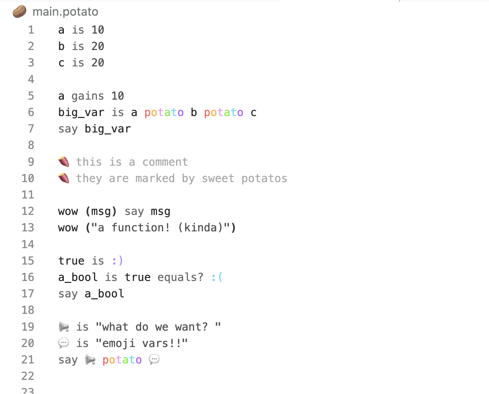
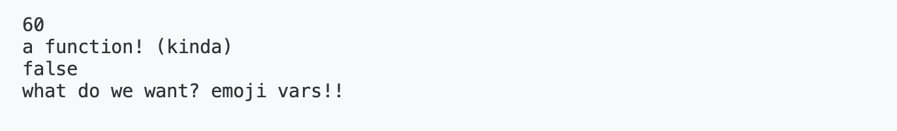

### 🥔 Potato

A made up bytecode interpreter that started out as a made up [tree-walking interpreter](https://notes.juliab.dev/thoughts/potato)! (I wrote about it for CS 2130 & 3110)





#### types

- integers: `2`, `20000000000`
- strings: `"wow!"`, `"a string!"`
- booleans: `:)`, `:(`
- null: `nothing`

#### comments

```
🍠 this is a comment
say "hello" 🍠 this is an inline comment
```

#### functions

`()` connect function names to their body. Statements can be separated by commas. The last value is returned

```potato
double (n) n potato n
say double (5)
say double (double (3)) 

frog (a, b) say a, say b
frog ("ribbet", "is that a fly?") 
```

#### `is`

Assigns a value

```potato
dog is "cute!"
say dog 
```

####  `potato` 

Adds numbers and concatenates strings

```potato
2 potato 2  
"hi" potato " bob" 
```

####  `is?`, `not?`

`:)` if both are equal, otherwise `:(` 

```potato
:) is? :)    🍠 true
:) is? :(    🍠 false
10 is? 10    🍠 true
"a" is? "b"  🍠 false
10 is? "10"  🍠 false

10 not? 10    🍠 false
10 not? 20    🍠 true
```

####  `bigger?`, `atleast?`

- `:)` if greater
- `:)` if greater or equal 

```potato
10 bigger? 10   🍠 false
10 atleast? 10   🍠 true
``` 

####  `smaller?`, `atmost?`

- `:)` if smaller
- `:)` if smaller or equal 

```potato
10 smaller? 10   🍠 false
10 atmost? 10   🍠 true
``` 

####  `and`, `or`

- `:)` if both are true
- `:)` if either is true

```potato
:) and :)    🍠 true
:) and :(    🍠 false
:) or :(     🍠 true
:( or :(     🍠 false
```

####  `?`, `:`, and `nothing`

- `?` if
- `:` else, can chain 
- `nothing` null (its falsey)

```potato
a is :) ? "true"
say a 🍠 "true"

b is :( ? "true" : "false"
say b 🍠 "false"

c is :( ? "true"
say c 🍠 nil

d is :) ? nothing
say d 🍠 nil
```

✨ aspirations ✨

unfortunately i've learned about self-hosting
 - ~~fix recursion~~
 - ~~more comparison~~
 - conditionals + loops
 - actual string helpers
 - heap
 - maybe? real stack

machine code ??
